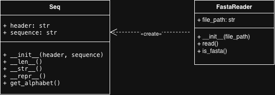

# Чтение FASTA-файлов

Программа для чтения и проверки файлов формата FASTA.

## Описание

Программа содержит два класса:

- `Seq` — хранит биологическую последовательность, позволяет узнать её длину и определить тип.
- `FastaReader` — читает FASTA-файлы и проверяет правильность их структуры.

Для чтения файлов используется генератор, поэтому последовательности обрабатываются по одной.

## Запуск программы

Для работы нужен Python 3.9 или новее.

Скачайте файлы проекта и выполните команду:

```bash
python3 main.py
```

Программа прочитает файл `example.fasta` и выведет последовательности, их длины и типы.

## Примеры файлов

- `example.fasta` — пример правильного FASTA-файла.
- `invalid.fasta` — пример файла с неправильной структурой.

## UML-диаграмма



## Документация

HTML-документация создана с помощью Sphinx.

Для просмотра откройте файл `docs/html/index.html`.

## Используемые инструменты

- Python
- Sphinx
- diagrams.net