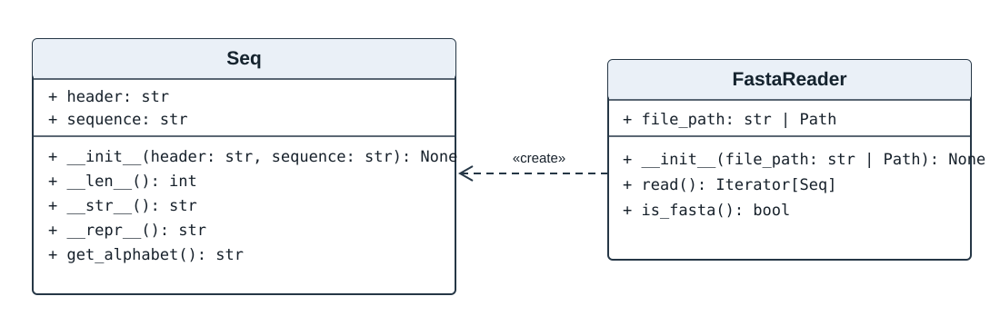

# FASTA Reader

Программа на Python для чтения и проверки биологических последовательностей в формате FASTA.

## Возможности

- `Seq` хранит FASTA-заголовок и последовательность, возвращает длину (`len`), строковое представление и определяет алфавит.
- `FastaReader` проверяет структуру FASTA и считывает записи, создавая отдельный объект `Seq` для каждой последовательности.
- Метод `read()` использует генератор `yield`: записи обрабатываются последовательно, без загрузки всего файла в память.
- Поддерживаются FASTA-файлы с одной или несколькими записями и многострочными последовательностями.
- Обрабатываются ошибки структуры FASTA, отсутствие файла и пустой пользовательский ввод.

> **Об определении алфавита:** нуклеотидный и белковый алфавиты частично пересекаются. Поэтому `get_alphabet()` может возвращать «неоднозначная», если набор символов подходит под оба алфавита. Это не ошибка чтения FASTA.

## Требования

- Python 3.9 или новее.
- Для запуска программы внешние библиотеки не требуются.
- Sphinx нужен только для повторной сборки документации.

## Установка

1. Откройте [страницу релизов](https://github.com/anya-karpova/fasta-reader/releases).
2. Скачайте **Source code (ZIP)** выбранной версии и распакуйте архив.
3. Откройте терминал в распакованной папке проекта.

Для загрузки актуальной ветки `main` вместо релиза можно использовать:

```bash
git clone https://github.com/anya-karpova/fasta-reader.git
cd fasta-reader
```

## Запуск

```bash
python3 main.py
```

После запроса введите имя FASTA-файла, например `sequence.fasta`.

Файл должен находиться в той же папке, что и `main.py`. Программа выводит заголовок, длину и результат определения алфавита каждой записи.

## Примеры FASTA-файлов

| Файл | Содержимое |
|---|---|
| `sequence.fasta` | мРНК BRCA1 человека |
| `tp53_mrna.fasta` | нуклеотидная последовательность TP53 |
| `tp53_protein.fasta` | белковая последовательность p53 |
| `mitochondrion_human.fasta` | митохондриальный геном человека |
| `multiple_sequences.fasta` | несколько FASTA-записей |
| `invalid.fasta` | некорректная FASTA-запись для проверки ошибок |

## Структура программы

### Класс `Seq`

- `header` — содержимое FASTA-заголовка;
- `sequence` — биологическая последовательность;
- `__str__()` — строка в формате FASTA;
- `__len__()` — длина последовательности;
- `__repr__()` — представление объекта;
- `get_alphabet()` — определение алфавита.

### Класс `FastaReader`

- `file_path` — путь к FASTA-файлу;
- `read()` — генератор объектов `Seq`;
- `is_fasta()` — проверка структуры файла (`True` или `False`).

Проверка `is_fasta()` ориентирована на **структуру** FASTA, а не на биологическую корректность каждого символа последовательности.

## UML-диаграмма



Диаграмма для просмотра: [`uml_readme.svg`](uml_readme.svg). Исходная редактируемая диаграмма: [`uml.drawio`](uml.drawio); PNG-версия: [`uml.png`](uml.png).

## Документация

HTML-документация классов собрана с помощью [Sphinx](https://www.sphinx-doc.org/):

- [`docs/html/index.html`](docs/html/index.html) — готовая HTML-документация;
- [`docs/index.rst`](docs/index.rst) — исходное описание API;
- [`docs/conf.py`](docs/conf.py) — настройки Sphinx.

Для повторной сборки (при установленном Sphinx):

```bash
python3 -m sphinx -b html docs docs/html
```

## Технологии

Python · Git · GitHub · Sphinx · diagrams.net

## Лицензия

[MIT](LICENSE)
